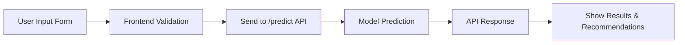

# Coal Miner Disease Detection Project

This project is a full-stack application for predicting disease risk levels in coal miners using a hybrid machine learning model. It consists of a React frontend and a Flask backend, with a trained model for inference.

---

## About the Project

Coal miners are exposed to hazardous environments that can lead to various respiratory and occupational diseases. This project aims to provide an automated, data-driven tool to assess disease risk levels based on health and environmental parameters, and to recommend precautionary measures.

**Key Features:**
- Predicts disease risk (Low/Medium/High) for miners based on input data.
- Provides recommendations for health and safety.
- User-friendly web interface for data entry and result display.
- Backend API for prediction and health checks.
- Model trained on real-world-like synthetic data with multiple disease classes.

---

## System Architecture

Below is a high-level architecture diagram of the project:

```mermaid
graph TD
    A[User (Miner/Doctor)] -->|Inputs Data| B[React Frontend]
    B -->|POST /predict| C[Flask Backend API]
    C -->|Model Inference| D[Hybrid ML Model (RandomForest/XGBoost)]
    D -->|Prediction & Recommendations| C
    C -->|Response| B
    B -->|Displays Results| A
```

---

## Data Flow Diagram



---

## Screenshots

Below are screenshots of the application at various stages:

1. **Home Page**
   

2. **Disease Detection Form**
   

3. **Prediction Result**
   

4. **Recommendations Display**
   
---

## How to Run

1. **Backend**
   - Install dependencies: `pip install -r requirements.txt`
   - Run: `python backend/app.py`

2. **Frontend**
   - Install dependencies: `npm install`
   - Run: `npm start`

3. **Access the app** at `http://localhost:3000`

---

## Technologies Used

- **Frontend:** React, CSS
- **Backend:** Flask, Flask-CORS, scikit-learn, XGBoost, joblib
- **ML Model:** Hybrid Voting Classifier (RandomForest + XGBoost)
- **Visualization:** Mermaid diagrams

---

## Project Structure

