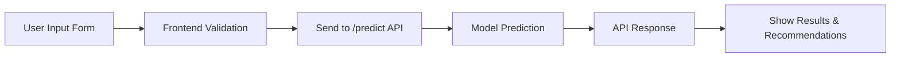

# CoalMiner Project

This project predicts disease risk levels for coal miners using a hybrid machine learning model (RandomForest/XGBoost). It features a React frontend and a Flask backend API.

---

## About the Project

Coal miners are exposed to hazardous environments that can lead to various respiratory and occupational diseases. This project aims to provide an automated, data-driven tool to assess disease risk levels based on health and environmental parameters, and to recommend precautionary measures.

**Key Features:**
- Predicts disease risk (Low/Medium/High) for miners based on input data.
- Provides recommendations for health and safety.
- User-friendly web interface for data entry and result display.
- Backend API for prediction and health checks.
- Model trained on real-world-like synthetic data with multiple disease classes.

---

## Data Flow Diagram



---

## Components

- **Frontend:** React app for user input and displaying results.
- **Backend:** Flask API for model inference and recommendations.
- **Model:** Hybrid ML model trained on mining health data.

---

## Screenshots

Below are screenshots of the application at various stages:

1. **Home Page**
   

2. **Disease Detection Form**
   

3. **Prediction Result**
   

4. **Recommendations Display**
   
---

## Usage

1. Start the Flask backend (`python backend/app.py`).
2. Start the React frontend (`npm start` in `frontend`).
3. Enter miner health/environment data in the UI to get predictions.

---

## Model Features

- Age, Years in Mining, Smoking History, Cough Frequency, Breathlessness, Chest Pain, Oxygen Saturation, Heart Rate, Body Temperature, Air Quality Index, PM2.5, CO Level, Ambient Temperature, PPE Usage, Medication Use.

---

## Prediction Output

- **Risk Level:** Low, Medium, or High
- **Probability:** Model confidence
- **Recommendations:** Health and safety actions

---

## Technologies Used

- **Frontend:** React, CSS
- **Backend:** Flask, Flask-CORS, scikit-learn, XGBoost, joblib
- **ML Model:** Hybrid Voting Classifier (RandomForest + XGBoost)
- **Visualization:** Mermaid diagrams

---

## Project Structure
```plaintext
CoalMiner/
├── backend/
│   ├── app.py                # Flask API entry point
│   ├── requirements.txt      # Backend dependencies
│   ├── model/
│   │   ├── model.pkl         # Trained ML model
│   │   ├── preprocess.py     # Data preprocessing scripts
│   │   └── utils.py          # Utility functions
│   └── tests/
│       └── test_api.py       # API test cases
├── frontend/
│   ├── public/
│   │   └── index.html        # HTML template
│   ├── src/
│   │   ├── App.js            # Main React component
│   │   ├── components/
│   │   │   ├── Form.js       # Input form component
│   │   │   ├── Results.js    # Results display component
│   │   │   └── Header.js     # Header component
│   │   ├── styles/
│   │   │   └── App.css       # CSS styles
│   │   └── utils/
│   │       └── api.js        # API interaction functions
│   └── package.json          # Frontend dependencies
├── data/
│   ├── synthetic_data.csv    # Training dataset
│   └── schema.json           # Data schema
├── docs/
│   ├── README.md             # Project documentation
│   └── diagrams/
│       ├── architecture.png  # Architecture diagram
│       └── data_flow.png     # Data flow diagram
└── .gitignore                # Git ignore file
```

---

# System Architecture

Below is a textual description of the architecture for your coal mining disease prediction system:

- **User (Miner/Doctor)**: Interacts with the system via a web interface.
- **React Frontend**: Collects user input and sends it to the backend via HTTP POST requests.
- **Flask Backend API**: Receives requests, processes input, and invokes the machine learning model for inference.
- **Hybrid ML Model (RandomForest/XGBoost)**: Performs disease risk prediction and returns recommendations.
- **Response Flow**: The backend sends prediction results and recommendations back to the frontend, which displays them to the user.
